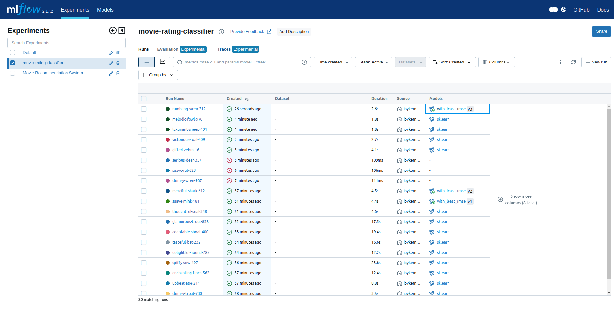

## Installation

1. Clone the repository,navigate to repository using terminal and run:

   ```bash
        docker build -t myfastapiapp .
        docker run -d -p 8000:8000 --name fastapi_container myfastapiapp

2. Open postman or curl and send post request to: http://0.0.0.0:8000/predict
   ```json
        {
    "gender_F": 0,
    "gender_M": 1,
    "occupation_administrator": 0,
    "occupation_artist": 0,
    "occupation_doctor": 1,
    "occupation_educator": 0,
    "occupation_engineer": 0,
    "occupation_entertainment": 0,
    "occupation_executive": 0,
    "occupation_healthcare": 0,
    "occupation_homemaker": 0,
    "occupation_lawyer": 0,
    "occupation_librarian": 0,
    "occupation_marketing": 0,
    "occupation_none": 0,
    "occupation_other": 0,
    "occupation_programmer": 0,
    "occupation_retired": 0,
    "occupation_salesman": 0,
    "occupation_scientist": 0,
    "occupation_student": 0,
    "occupation_technician": 0,
    "occupation_writer": 0,
    "genre_1": 1,
    "genre_2": 1,
    "genre_3": 1,
    "genre_4": 1,
    "genre_5": 0,
    "genre_6": 0,
    "genre_7": 1,
    "genre_8": 1,
    "genre_9": 0,
    "genre_10": 0,
    "genre_11": 0,
    "genre_12": 0,
    "genre_13": 0,
    "genre_14": 0,
    "genre_15": 0,
    "genre_16": 0,
    "genre_17": 1,
    "genre_18": 0,
    "genre_19": 0,
    "age_age1": 0,
    "age_age2": 0,
    "age_age3": 1,
    "age_age4": 0
    }

  





